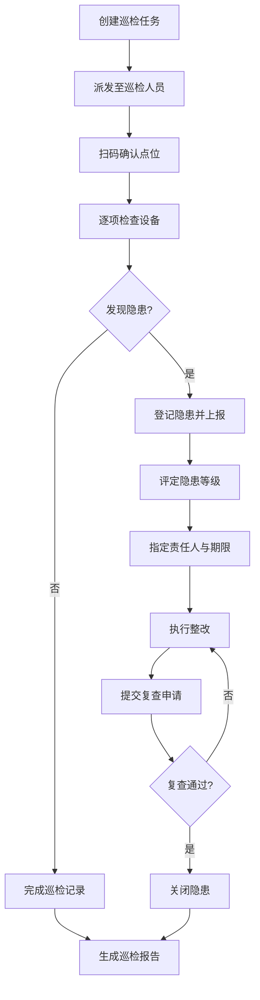

## 1. 产品概述

消防巡检管理平台是一款面向园区物业和安全主管的日常管理工具，旨在系统化、标准化消防巡检流程，提升消防安全管理效率，降低火灾风险。

- **核心目标**：实现消防设施全生命周期管理、巡检任务闭环执行、隐患整改全程追踪、演练数据沉淀分析
- **目标用户**：园区物业管理人员、安全主管、巡检人员、部门负责人
- **核心价值**：数字化巡检流程、可视化风险态势、可追溯整改记录、智能化统计分析

## 2. 核心功能

### 2.1 用户角色

| 角色 | 注册方式 | 核心权限 |
|------|---------|----------|
| 安全主管 | 系统分配 | 全功能访问、数据导出、任务派发、隐患审批 |
| 物业管理员 | 系统分配 | 建筑/设备管理、巡检任务分配、查看报表 |
| 巡检人员 | 系统分配 | 执行巡检、扫码确认、上报隐患、上传照片 |
| 部门负责人 | 系统分配 | 查看本部门隐患、审批整改、复查关闭 |

### 2.2 功能模块

1. **总览页面**：风险态势大屏、待办提醒、统计概览、风险楼栋Top5、逾期预警
2. **建筑档案**：楼栋信息管理、楼层信息、风险等级、点位分布、历史变更记录
3. **设备台账**：灭火器/喷淋/烟感等设备管理、设备状态、维护记录、检查周期设置
4. **巡检任务**：任务创建、周期设置、任务派发、扫码巡检、照片上传、备注记录
5. **隐患整改**：隐患登记、等级评定、责任人指定、整改期限、进度跟踪、复查关闭
6. **演练记录**：消防演练计划、签到记录、演练评语、照片归档、历史演练查询
7. **统计报表**：按部门统计逾期、月度报表导出、整改率分析、设备完好率、巡检完成率

### 2.3 页面详情

| 页面名称 | 模块名称 | 功能描述 |
|---------|---------|---------|
| 总览 | 风险态势卡片 | 显示楼栋总数、设备总数、待处理隐患、逾期数 |
| 总览 | 待办提醒列表 | 展示待巡检、待整改、待复查的任务提醒 |
| 总览 | 风险楼栋排名 | Top5高风险楼栋排序展示，含风险等级标签 |
| 总览 | 趋势图表 | 近30天巡检完成率、隐患整改率趋势图 |
| 建筑档案 | 楼栋列表 | 卡片式展示所有楼栋，支持筛选搜索 |
| 建筑档案 | 楼栋详情 | 基本信息、楼层数、建筑面积、风险等级、点位数量 |
| 建筑档案 | 点位分布 | 巡检点位列表，含二维码标识、位置描述 |
| 建筑档案 | 变更历史 | 楼栋信息修改记录，含操作人、时间、变更内容 |
| 设备台账 | 设备分类 | 按灭火器/喷淋/烟感/消火栓分类筛选 |
| 设备台账 | 设备列表 | 设备编号、名称、型号、位置、状态、下次检查时间 |
| 设备台账 | 检查周期 | 为不同设备类型设置检查周期（月度/季度/年度） |
| 设备台账 | 维护记录 | 设备检查、维修、更换的历史记录 |
| 巡检任务 | 任务列表 | 按状态筛选：待执行、执行中、已完成、已逾期 |
| 巡检任务 | 创建任务 | 选择楼栋/点位/周期、指定巡检人员、设置截止时间 |
| 巡检任务 | 执行任务 | 扫码确认点位、上传现场照片、填写巡检备注 |
| 巡检任务 | 任务详情 | 巡检内容清单、完成进度、异常记录 |
| 隐患整改 | 隐患列表 | 按等级/状态/部门筛选，含红橙黄蓝等级标签 |
| 隐患整改 | 登记隐患 | 选择点位、填写描述、上传照片、评定等级 |
| 隐患整改 | 派单整改 | 指定责任部门/人、设置整改期限、下发通知 |
| 隐患整改 | 复查关闭 | 整改完成后提交复查、审批通过后关闭隐患 |
| 演练记录 | 演练列表 | 按时间/类型/参与部门筛选 |
| 演练记录 | 演练签到 | 人员签到列表、签到时间、缺席人员标注 |
| 演练记录 | 演练评语 | 演练总结、问题记录、改进建议 |
| 演练记录 | 资料归档 | 演练照片、方案文档、总结报告上传保存 |
| 统计报表 | 部门逾期统计 | 按部门统计逾期隐患数量及占比的柱状图 |
| 统计报表 | 月度报表 | 按月汇总巡检、隐患、整改、演练数据 |
| 统计报表 | 导出功能 | 支持Excel/PDF格式导出月度报表 |
| 统计报表 | 多维分析 | 整改率、设备完好率、巡检完成率等指标分析 |

## 3. 核心流程

### 3.1 巡检任务流程
安全主管创建巡检任务，指定巡检人员和检查周期。巡检人员收到任务提醒后，按计划前往各楼栋点位，扫描二维码确认到达，逐项检查设备并上传照片备注，发现异常可直接上报隐患。任务完成后系统自动记录并生成巡检报告。

### 3.2 隐患整改流程
巡检发现隐患或日常排查登记隐患后，安全主管评定隐患等级（重大/较大/一般/轻微），指定责任部门和整改期限。责任人收到通知后实施整改，完成后提交复查申请。安全主管或部门负责人现场复查，确认整改合格则关闭隐患，不合格则退回重新整改。

### 3.3 演练管理流程
安全主管制定消防演练计划，明确时间、地点、参与部门和演练内容。演练当天参与人员扫码签到，演练过程拍摄记录照片。演练结束后填写评语总结，记录问题和改进建议，所有资料归档保存，可随时查询历史演练记录。

## 4. 用户界面设计

### 4.1 设计风格
- **主色调**：消防红 (#DC2626) 作为主色，搭配深钢蓝 (#1E3A5F) 作为辅助色，体现安全与专业
- **中性色**：以石板灰 (Slate) 为基础，保证信息可读性
- **按钮风格**：圆角4px，主色按钮带微立体阴影，悬停时轻微上浮
- **字体**：标题使用思源黑体加粗，正文使用思源黑体 Regular，数据表格使用等宽字体增强可读性
- **布局风格**：左侧导航栏 + 顶部面包屑 + 主内容卡片式布局
- **图标风格**：Lucide图标库，填充风格统一，尺寸16-20px
- **视觉层次**：卡片带柔和阴影，关键数据使用渐变背景卡片突出展示

### 4.2 页面设计概述

| 页面名称 | 模块名称 | UI元素 |
|---------|---------|--------|
| 总览 | 风险态势卡片 | 渐变背景统计卡片、数据动画、风险等级色标 |
| 总览 | 待办提醒 | 带图标的列表项、红点提醒、快速操作按钮 |
| 总览 | 趋势图表 | 双折线图、渐变填充、悬浮提示 |
| 建筑档案 | 楼栋列表 | 网格卡片布局、风险标签、缩略图、悬停浮层 |
| 建筑档案 | 楼栋详情 | 标签页切换、信息分组、时间线展示变更历史 |
| 设备台账 | 设备列表 | 数据表格、状态徽章、搜索筛选工具栏 |
| 设备台账 | 周期设置 | 下拉选择器、开关组件、预览时间轴 |
| 巡检任务 | 任务看板 | 四列看板（待执行/执行中/已完成/逾期）、拖拽感 |
| 巡检任务 | 执行界面 | 扫码区域、图片上传、复选清单、进度条 |
| 隐患整改 | 隐患列表 | 四色等级标签、进度条、负责人头像 |
| 隐患整改 | 详情弹窗 | 步骤条、表单分组、审批按钮组 |
| 演练记录 | 演练卡片 | 时间轴布局、签到人数进度、照片墙缩略图 |
| 统计报表 | 图表区 | 多标签切换、柱状图+饼图组合、数据表格联动 |
| 统计报表 | 导出区 | 格式选择、日期范围、导出预览按钮 |

### 4.3 响应式设计
- **桌面优先**：以1440px宽度为基准设计，主内容区最小宽度1200px
- **平板适配**：≥768px时左侧导航折叠为图标模式，卡片网格从3列调整为2列
- **移动端**：<768px时导航变为底部Tab栏，卡片改为单列布局，表格支持横向滚动
- **触摸优化**：按钮最小尺寸44x44px，重要操作区域增加内边距，支持下拉刷新

### 4.4 数据可视化指导
- **图表库**：使用Recharts实现图表渲染
- **颜色语义**：红色代表风险/逾期、绿色代表正常/完成、黄色代表警告/进行中、蓝色代表计划/待处理
- **动画效果**：数据加载时数值递增动画，图表曲线渐进绘制
- **交互增强**：图表悬浮显示详细数据，支持点击区域联动筛选列表数据
