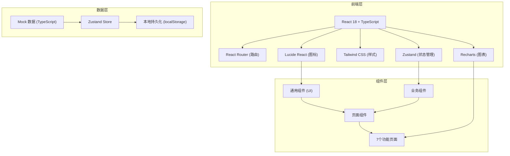
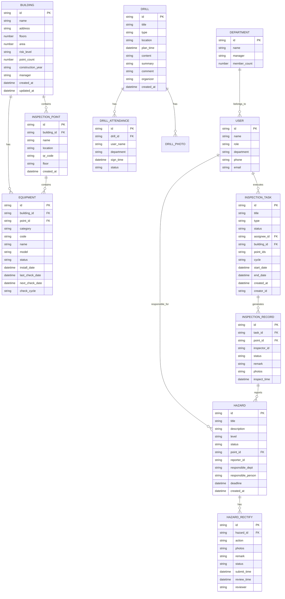

## 1. 架构设计



## 2. 技术描述

- **前端框架**：React 18 + TypeScript
- **初始化工具**：Vite (vite-init)
- **后端**：无后端，使用前端Mock数据 + Zustand状态管理
- **状态管理**：Zustand 4.x，支持本地持久化
- **路由**：React Router DOM 6.x
- **样式方案**：Tailwind CSS 3.x
- **图标库**：Lucide React
- **图表库**：Recharts 2.x
- **数据持久化**：localStorage

## 3. 路由定义

| 路由路径 | 页面名称 | 说明 |
|---------|---------|------|
| / | 总览 | 风险态势大屏、待办提醒、统计概览 |
| /buildings | 建筑档案 | 楼栋列表、楼栋详情、点位分布、变更历史 |
| /equipment | 设备台账 | 设备分类管理、检查周期设置、维护记录 |
| /inspections | 巡检任务 | 任务看板、创建任务、扫码巡检、任务详情 |
| /hazards | 隐患整改 | 隐患列表、登记派单、整改跟踪、复查关闭 |
| /drills | 演练记录 | 演练列表、签到管理、演练评语、资料归档 |
| /reports | 统计报表 | 部门逾期统计、月度报表、导出功能 |

## 4. 数据模型

### 4.1 数据模型关系图



### 4.2 核心枚举定义

```typescript
// 风险等级
enum RiskLevel {
  HIGH = 'high',      // 高风险 - 红色
  MEDIUM = 'medium',  // 中风险 - 橙色
  LOW = 'low',        // 低风险 - 黄色
  NORMAL = 'normal'   // 正常 - 蓝色
}

// 设备类型
enum EquipmentCategory {
  FIRE_EXTINGUISHER = 'fire_extinguisher',  // 灭火器
  SPRINKLER = 'sprinkler',                   // 喷淋
  SMOKE_DETECTOR = 'smoke_detector',         // 烟感
  FIRE_HYDRANT = 'fire_hydrant',             // 消火栓
  FIRE_ALARM = 'fire_alarm',                 // 火灾报警器
  EMERGENCY_LIGHT = 'emergency_light'        // 应急照明
}

// 设备状态
enum EquipmentStatus {
  NORMAL = 'normal',        // 正常
  MAINTENANCE = 'maintenance',  // 维护中
  FAULT = 'fault',          // 故障
  EXPIRED = 'expired'       // 过期
}

// 巡检任务状态
enum TaskStatus {
  PENDING = 'pending',      // 待执行
  IN_PROGRESS = 'in_progress', // 执行中
  COMPLETED = 'completed',  // 已完成
  OVERDUE = 'overdue'       // 已逾期
}

// 隐患等级
enum HazardLevel {
  CRITICAL = 'critical',    // 重大隐患 - 红
  MAJOR = 'major',          // 较大隐患 - 橙
  GENERAL = 'general',      // 一般隐患 - 黄
  MINOR = 'minor'           // 轻微隐患 - 蓝
}

// 隐患状态
enum HazardStatus {
  REGISTERED = 'registered',   // 已登记
  ASSIGNED = 'assigned',       // 已派单
  RECTIFYING = 'rectifying',   // 整改中
  PENDING_REVIEW = 'pending_review', // 待复查
  CLOSED = 'closed'            // 已关闭
}

// 检查周期
enum CheckCycle {
  MONTHLY = 'monthly',      // 月度
  QUARTERLY = 'quarterly',  // 季度
  SEMI_ANNUAL = 'semi_annual', // 半年
  ANNUAL = 'annual'         // 年度
}

// 演练类型
enum DrillType {
  FIRE_EVACUATION = 'fire_evacuation',     // 消防疏散
  FIRE_EXTINGUISHER = 'fire_extinguisher', // 灭火器使用
  EMERGENCY_RESPONSE = 'emergency_response', // 应急响应
  COMBINED = 'combined'                     // 综合演练
}
```

## 5. 项目目录结构

```
d:\TraeProjects\1134/
├── .trae/documents/              # 文档目录
├── src/
│   ├── components/               # 通用组件
│   │   ├── layout/               # 布局组件
│   │   │   ├── Sidebar.tsx       # 侧边导航
│   │   │   ├── Header.tsx        # 顶部栏
│   │   │   └── AppLayout.tsx     # 主布局
│   │   ├── ui/                   # UI基础组件
│   │   │   ├── Card.tsx
│   │   │   ├── Button.tsx
│   │   │   ├── Badge.tsx
│   │   │   ├── Tag.tsx
│   │   │   ├── Modal.tsx
│   │   │   ├── Table.tsx
│   │   │   ├── Input.tsx
│   │   │   └── Tabs.tsx
│   │   └── charts/               # 图表组件
│   │       ├── LineChartCard.tsx
│   │       ├── BarChartCard.tsx
│   │       └── PieChartCard.tsx
│   ├── pages/                    # 页面组件
│   │   ├── Dashboard.tsx         # 总览
│   │   ├── Buildings.tsx         # 建筑档案
│   │   ├── Equipment.tsx         # 设备台账
│   │   ├── Inspections.tsx       # 巡检任务
│   │   ├── Hazards.tsx           # 隐患整改
│   │   ├── Drills.tsx            # 演练记录
│   │   └── Reports.tsx           # 统计报表
│   ├── store/                    # 状态管理
│   │   └── index.ts              # Zustand Store
│   ├── data/                     # Mock数据
│   │   ├── buildings.ts
│   │   ├── equipment.ts
│   │   ├── inspections.ts
│   │   ├── hazards.ts
│   │   ├── drills.ts
│   │   └── users.ts
│   ├── types/                    # 类型定义
│   │   └── index.ts
│   ├── utils/                    # 工具函数
│   │   ├── date.ts
│   │   ├── format.ts
│   │   └── export.ts
│   ├── hooks/                    # 自定义Hooks
│   │   └── useCountUp.ts
│   ├── App.tsx
│   ├── main.tsx
│   └── index.css
├── index.html
├── package.json
├── tsconfig.json
├── vite.config.ts
├── tailwind.config.js
└── postcss.config.js
```

## 6. 状态管理设计

### 6.1 Zustand Store 结构

```typescript
interface AppState {
  // 数据
  buildings: Building[];
  equipment: Equipment[];
  inspectionTasks: InspectionTask[];
  inspectionRecords: InspectionRecord[];
  hazards: Hazard[];
  hazardRectifies: HazardRectify[];
  drills: Drill[];
  drillAttendances: DrillAttendance[];
  users: User[];
  departments: Department[];

  // 筛选状态
  filters: {
    buildingId?: string;
    equipmentCategory?: string;
    taskStatus?: string;
    hazardLevel?: string;
    hazardStatus?: string;
    dateRange?: [Date, Date];
    departmentId?: string;
  };

  // 操作方法
  setFilters: (filters: Partial<AppState['filters']>) => void;
  
  // 建筑相关
  addBuilding: (data: Omit<Building, 'id' | 'created_at' | 'updated_at'>) => void;
  updateBuilding: (id: string, data: Partial<Building>) => void;
  deleteBuilding: (id: string) => void;
  getBuildingById: (id: string) => Building | undefined;
  
  // 设备相关
  addEquipment: (data: Omit<Equipment, 'id'>) => void;
  updateEquipment: (id: string, data: Partial<Equipment>) => void;
  setEquipmentCycle: (category: string, cycle: CheckCycle) => void;
  
  // 巡检任务相关
  createInspectionTask: (data: Omit<InspectionTask, 'id' | 'created_at'>) => void;
  updateTaskStatus: (id: string, status: TaskStatus) => void;
  addInspectionRecord: (data: Omit<InspectionRecord, 'id'>) => void;
  
  // 隐患相关
  registerHazard: (data: Omit<Hazard, 'id' | 'created_at' | 'status'>) => void;
  assignHazard: (id: string, data: Pick<Hazard, 'responsible_dept' | 'responsible_person' | 'deadline'>) => void;
  submitRectify: (data: Omit<HazardRectify, 'id' | 'status'>) => void;
  reviewHazard: (id: string, passed: boolean, reviewer: string) => void;
  
  // 演练相关
  createDrill: (data: Omit<Drill, 'id' | 'created_at'>) => void;
  signInDrill: (drillId: string, attendance: Omit<DrillAttendance, 'id'>) => void;
  updateDrillComment: (id: string, comment: string, summary: string) => void;
  
  // 统计方法
  getStatistics: () => Statistics;
  getDepartmentOverdue: () => DepartmentOverdue[];
  getMonthlyReport: (year: number, month: number) => MonthlyReport;
}
```
